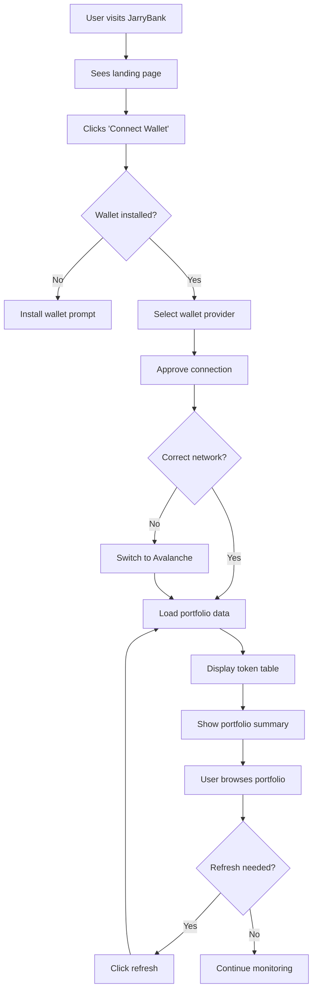
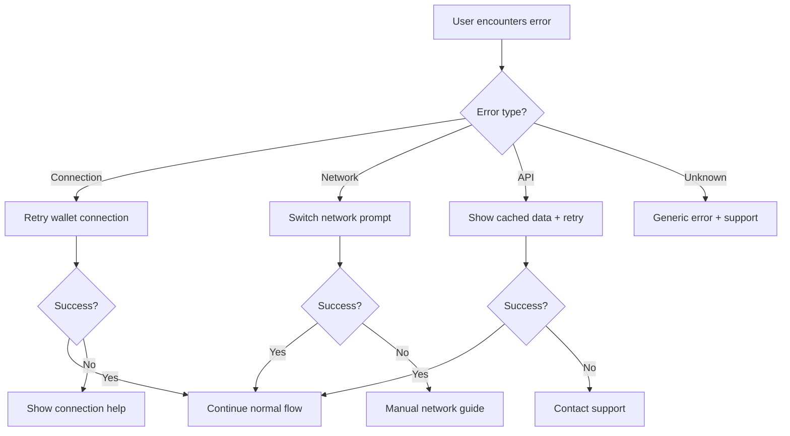

# JarryBank Product Requirements Document (PRD)

## Document Information

| Field | Value |
|-------|--------|
| **Product Name** | JarryBank |
| **Version** | 1.0 |
| **Date** | January 10, 2025 |
| **Product Owner** | Sarah (Technical Product Owner) |
| **Status** | Draft |
| **Last Updated** | January 10, 2025 |

---

## Executive Summary

**JarryBank** is a modern Web3 portfolio management application that provides Avalanche users with real-time visibility into their token holdings, balances, and portfolio performance. Built as a serverless application on Next.js 15.4 with native Web3 wallet integration, JarryBank delivers a seamless, fast, and secure experience for crypto portfolio tracking without the complexity of traditional authentication systems.

**Key Value Proposition:** Enable Avalanche users to instantly view and track their complete token portfolio through a simple wallet connection, with real-time price data and portfolio analytics.

---

## Product Vision & Goals

### Vision Statement
*"To be the premier portfolio viewing experience for Avalanche users, providing instant, accurate, and beautiful insights into their Web3 assets."*

### Strategic Goals
1. **Simplify Web3 Portfolio Management**: Eliminate complexity barriers that prevent users from easily tracking their crypto assets
2. **Deliver Superior User Experience**: Provide fastest and most intuitive portfolio viewing experience in the Avalanche ecosystem  
3. **Build Trust Through Transparency**: Offer accurate, real-time data with multiple data source validation
4. **Enable Informed Decision Making**: Present portfolio data in actionable formats that help users understand their asset performance

### Success Criteria
- **User Adoption**: 10,000+ unique wallet connections within 6 months of launch
- **Performance**: < 2 second portfolio load times from wallet connection
- **Reliability**: 99.5% uptime with accurate price data from multiple sources
- **User Satisfaction**: Net Promoter Score (NPS) > 50 based on user feedback

---

## Market Analysis

### Target Market Size
- **Total Addressable Market (TAM)**: 5.2M active Avalanche addresses (Q4 2024)
- **Serviceable Addressable Market (SAM)**: 800K active Avalanche users with >$100 portfolio value  
- **Serviceable Obtainable Market (SOM)**: 80K users seeking portfolio management tools (10% of SAM)

### Competitive Analysis

| Competitor | Strengths | Weaknesses | Differentiation Opportunity |
|------------|-----------|------------|---------------------------|
| **DeBank** | Multi-chain support, comprehensive features | Slow loading, complex UI | Faster, Avalanche-focused experience |
| **Zapper** | DeFi protocol integration, advanced analytics | Complex for casual users | Simplified portfolio view |
| **Zerion** | Beautiful UI, mobile app | Limited Avalanche support | Native Avalanche optimization |
| **Portfolio tracker dApps** | Blockchain native | Poor UX, limited features | Professional-grade UI/UX |

**Competitive Advantage**: JarryBank combines the speed and simplicity of modern web applications with native Web3 functionality, specifically optimized for the Avalanche ecosystem.

---

## User Personas

### Primary Persona: "Alex the Active Trader"
- **Demographics**: 28-45 years old, tech-savvy, crypto-native
- **Behavior**: Trades 2-5 times per week, holds 8-15 different tokens
- **Goals**: Quick portfolio overview, real-time price tracking, performance monitoring
- **Pain Points**: Slow portfolio loading, inaccurate price data, complex interfaces
- **Use Cases**: Daily portfolio check, pre-trade analysis, performance review

### Secondary Persona: "Sam the Steady Holder"  
- **Demographics**: 35-55 years old, financially focused, moderate tech skills
- **Behavior**: Checks portfolio 2-3 times per week, holds 3-8 core positions
- **Goals**: Long-term portfolio tracking, simple value overview
- **Pain Points**: Overwhelming interfaces, unclear token information
- **Use Cases**: Weekly portfolio review, tax preparation, asset allocation check

### Tertiary Persona: "Casey the Crypto Curious"
- **Demographics**: 22-35 years old, new to crypto, learning-oriented  
- **Behavior**: Recently got first wallet, holds 1-3 tokens, learning about DeFi
- **Goals**: Understand portfolio value, learn about tokens they own
- **Pain Points**: Complex terminology, confusing interfaces, lack of educational context
- **Use Cases**: Portfolio discovery, learning about owned assets

---

## User Stories & Requirements

### Epic 1: Project Foundation & Setup

#### Story 1.1: Project Scaffolding & Infrastructure Setup
**As a** developer  
**I want to** establish the foundational project structure and infrastructure  
**So that** I can build JarryBank features on a solid technical foundation

**Priority**: P0 (Critical)

**Acceptance Criteria**:
- [ ] Next.js 15.4 project initialized with TypeScript and App Router
- [ ] Tailwind CSS 4.0 and shadcn/ui component system configured
- [ ] Project folder structure established (components, pages, lib, types)
- [ ] ESLint, Prettier, and TypeScript configuration files set up
- [ ] Vercel deployment configuration and environment setup
- [ ] Basic package.json with all required dependencies
- [ ] Git repository initialized with appropriate .gitignore
- [ ] Development and build scripts functional (npm run dev, npm run build)

#### Story 1.2: Basic UI Layout & Landing Page
**As a** user visiting JarryBank  
**I want to** see a professional landing page with clear branding  
**So that** I understand what JarryBank offers and how to get started

**Priority**: P0 (Critical)

**Acceptance Criteria**:
- [ ] Clean, responsive landing page with JarryBank branding
- [ ] Clear value proposition and call-to-action messaging
- [ ] Navigation header with logo and main navigation items
- [ ] Footer with basic links and information
- [ ] Mobile-responsive design across all viewport sizes
- [ ] Loading properly on development server (npm run dev)
- [ ] Basic SEO meta tags and favicon configured

#### Story 1.3: Connect Web3 Wallet
**As a** crypto user  
**I want to** connect my Web3 wallet to JarryBank  
**So that** I can view my token portfolio without creating accounts or passwords

**Priority**: P0 (Critical)

**Acceptance Criteria**:
- [ ] RainbowKit and Wagmi 2.16+ integration configured
- [ ] "Connect Wallet" button prominently displayed on landing page
- [ ] System supports MetaMask, WalletConnect, and major wallet providers via RainbowKit
- [ ] Smart contract wallet support (Coinbase Smart Wallet, Argent)
- [ ] Connection process completes in < 5 seconds
- [ ] User sees their wallet address displayed after successful connection
- [ ] User can switch between multiple connected accounts
- [ ] System displays clear error messages for connection failures
- [ ] Connection persists across browser sessions until explicitly disconnected

#### Story 1.4: Wallet Network Validation
**As a** user connecting my wallet  
**I want to** be guided to the correct network  
**So that** I can view my Avalanche assets accurately

**Priority**: P0 (Critical)

**Acceptance Criteria**:
- [ ] System detects if user is on incorrect network (not Avalanche C-Chain)
- [ ] User sees clear prompt to switch to Avalanche network
- [ ] System provides one-click network switching functionality
- [ ] User sees confirmation when successfully connected to Avalanche
- [ ] System handles network switching errors gracefully

### Epic 2: Token Portfolio Display

#### Story 2.1: View Token Balances
**As a** connected wallet user  
**I want to** see all my token balances in one place  
**So that** I can understand my complete portfolio composition

**Priority**: P0 (Critical)

**Acceptance Criteria**:
- [ ] System displays comprehensive table of all user's tokens
- [ ] Each token shows: name, symbol, balance, USD value, logo
- [ ] Native AVAX balance is prominently displayed
- [ ] Zero-balance tokens are hidden by default (with option to show)
- [ ] Token data loads within 2 seconds of wallet connection
- [ ] System handles missing token metadata gracefully
- [ ] User can manually refresh token balances with loading indicator

#### Story 2.2: Portfolio Summary Dashboard  
**As a** portfolio owner  
**I want to** see my total portfolio value and key metrics  
**So that** I can quickly assess my overall financial position

**Priority**: P0 (Critical)

**Acceptance Criteria**:
- [ ] Dashboard displays total portfolio value in USD
- [ ] Shows 24-hour portfolio change ($ and %)
- [ ] Displays total number of unique tokens held
- [ ] Includes timestamp of last data update
- [ ] Portfolio metrics update when individual token prices change
- [ ] Visual indicators (green/red) for positive/negative changes

#### Story 2.3: Real-time Price Updates
**As a** portfolio tracker  
**I want to** see current token prices update in real-time  
**So that** I can monitor my portfolio performance throughout the day

**Priority**: P1 (High)

**Acceptance Criteria**:
- [ ] Token prices update automatically every 30 seconds
- [ ] Price changes are visually highlighted when they update
- [ ] 24-hour price change percentages display with color coding
- [ ] System falls back to cached prices when APIs are unavailable
- [ ] User can manually trigger price refresh with loading state
- [ ] Last updated timestamp shows for price data

### Epic 3: User Experience & Interface

#### Story 3.1: Responsive Design
**As a** mobile user  
**I want to** access JarryBank on any device  
**So that** I can check my portfolio anywhere

**Priority**: P1 (High)

**Acceptance Criteria**:
- [ ] Application works seamlessly on desktop, tablet, and mobile
- [ ] Touch-friendly wallet connection on mobile devices
- [ ] Portfolio table adapts to different screen sizes
- [ ] All features accessible on mobile with good usability
- [ ] Fast loading on mobile networks (< 3 seconds on 3G)

#### Story 3.2: Loading States & Error Handling  
**As a** user waiting for data  
**I want to** see clear loading indicators and helpful error messages  
**So that** I understand what's happening and can take appropriate action

**Priority**: P1 (High)

**Acceptance Criteria**:
- [ ] Skeleton loaders display while portfolio data loads
- [ ] Clear error messages for connection failures
- [ ] Retry mechanisms for failed API calls
- [ ] Graceful degradation when external services are unavailable
- [ ] User-friendly explanations for technical errors
- [ ] Loading indicators for all async operations

### Epic 4: Data Accuracy & Performance

#### Story 4.1: Multi-source Price Validation
**As a** portfolio tracker  
**I want to** receive accurate price data  
**So that** my portfolio valuation is reliable for decision making

**Priority**: P1 (High)

**Acceptance Criteria**:
- [ ] System fetches prices from multiple sources (Moralis + CoinMarketCap)
- [ ] Price discrepancies > 5% trigger validation checks
- [ ] Fallback pricing when primary source is unavailable
- [ ] Price data accuracy indicators (confidence levels)
- [ ] Historical price validation for consistency

#### Story 4.2: Performance Optimization
**As a** user with a large portfolio  
**I want to** quickly load my complete portfolio  
**So that** I can efficiently monitor my holdings

**Priority**: P1 (High)

**Acceptance Criteria**:
- [ ] Portfolio loads within 2 seconds for wallets with < 50 tokens
- [ ] Graceful performance scaling for wallets with 50+ tokens
- [ ] Efficient caching prevents unnecessary API calls
- [ ] Optimistic updates for better perceived performance
- [ ] Progressive loading for large portfolios

---

## Functional Requirements

### Core Features

#### F1: Wallet Integration
- **RainbowKit Integration**: Support for MetaMask, WalletConnect, Coinbase Wallet, and other major providers
- **Multi-account Support**: Users can switch between connected wallet accounts
- **Network Detection**: Automatic detection and prompting for Avalanche C-Chain
- **Session Persistence**: Wallet connection maintained across browser sessions
- **Graceful Disconnection**: Clean wallet disconnection with state cleanup

#### F2: Token Data Management
- **Balance Fetching**: Real-time token balance retrieval via Avalanche RPC
- **Token Metadata**: Name, symbol, decimals, and logo information
- **Price Integration**: Multi-source price data from Moralis and CoinMarketCap APIs
- **Native Token Support**: Special handling for AVAX native token
- **Error Recovery**: Fallback mechanisms for missing or invalid token data

#### F3: Portfolio Analytics
- **Total Value Calculation**: Aggregated USD value of all holdings
- **Performance Metrics**: 24-hour change calculation for individual tokens and portfolio
- **Token Distribution**: Visual representation of portfolio composition
- **Historical Context**: Basic trend indicators for portfolio performance
- **Refresh Mechanisms**: Manual and automatic data refresh capabilities

#### F4: User Interface
- **Responsive Design**: Mobile-first design supporting all device types
- **Modern UI Components**: shadcn/ui component system with custom styling
- **Interactive Tables**: Sortable, filterable token tables with search functionality
- **Loading States**: Skeleton loaders and progress indicators
- **Error Boundaries**: Graceful error handling with recovery options

### Technical Features

#### T1: Performance & Scalability
- **Caching Strategy**: Multi-layer caching (browser, edge, API level)
- **Bundle Optimization**: Code splitting and lazy loading for optimal load times
- **API Rate Management**: Intelligent rate limiting and request optimization
- **Memory Management**: Efficient state management preventing memory leaks

#### T2: Security & Privacy
- **Wallet Security**: No private key storage, signature-based authentication
- **API Security**: Input validation, rate limiting, CORS protection
- **Data Privacy**: No personal data collection beyond wallet addresses
- **Secure Communication**: HTTPS enforcement and CSP headers

#### T3: Reliability & Monitoring
- **High Availability**: Multiple API fallbacks and error recovery
- **Performance Monitoring**: Real-time metrics and alerting
- **Error Tracking**: Comprehensive error logging and reporting
- **Health Checks**: System health monitoring and status reporting

---

## Non-Functional Requirements

### Performance Requirements
- **Page Load Time**: < 2 seconds for initial page load
- **Time to Interactive**: < 3 seconds on average connection
- **Portfolio Load Time**: < 2 seconds for wallets with < 50 tokens
- **API Response Time**: < 500ms for cached data, < 2s for fresh data
- **Concurrent Users**: Support 10,000 concurrent users without degradation

### Scalability Requirements  
- **User Growth**: Architecture supports 100,000+ registered wallets
- **Request Volume**: Handle 1,000 requests per second during peak usage
- **Data Scaling**: Efficient handling of wallets with 100+ token positions
- **Geographic Distribution**: Global CDN distribution for worldwide access

### Reliability Requirements
- **Uptime**: 99.5% availability (< 4 hours downtime per month)
- **Data Accuracy**: 99.9% accuracy for token balances and pricing
- **Error Rate**: < 0.1% error rate for critical user flows
- **Recovery Time**: < 5 minutes recovery from service disruptions

### Security Requirements
- **Authentication**: Wallet-based authentication only, no password storage
- **Data Protection**: No sensitive user data storage beyond wallet addresses  
- **API Security**: Rate limiting, input validation, CORS protection
- **Network Security**: HTTPS enforcement, CSP headers, XSS prevention

### Usability Requirements
- **Learning Curve**: New users can connect wallet and view portfolio in < 2 minutes
- **Accessibility**: WCAG 2.1 AA compliance for inclusive access
- **Cross-browser**: Support for Chrome, Firefox, Safari, Edge (last 2 versions)
- **Mobile Experience**: Full feature parity on mobile devices

---

## Success Metrics & KPIs

### Primary Metrics (North Star)

#### User Engagement
- **Monthly Active Wallets (MAW)**: Unique wallets connecting each month
  - Target: 10,000 MAW by month 6
- **Daily Active Wallets (DAW)**: Daily unique wallet connections
  - Target: 2,000 DAW by month 6
- **Wallet Connection Success Rate**: Percentage of successful wallet connections
  - Target: >95% success rate

#### Product Performance  
- **Time to Portfolio Load**: Average time from wallet connection to portfolio display
  - Target: <2 seconds average
- **Data Accuracy Rate**: Percentage of accurate token balance and price data
  - Target: >99% accuracy
- **User Retention**: Percentage of users returning within 30 days
  - Target: >40% 30-day retention

### Secondary Metrics

#### Technical Performance
- **Page Load Speed**: Average page load time across all pages
  - Target: <2 seconds
- **API Response Times**: Average response time for critical API endpoints
  - Target: <500ms for cached, <2s for fresh data
- **Error Rate**: Percentage of requests resulting in errors
  - Target: <0.5% error rate
- **Uptime**: System availability percentage
  - Target: >99.5% uptime

#### User Experience
- **Time to Value**: Time from landing page to viewing complete portfolio
  - Target: <30 seconds average
- **Portfolio Refresh Rate**: Frequency of portfolio data refreshes per user session
  - Target: >3 refreshes per session
- **Feature Adoption**: Percentage of users using each major feature
  - Target: >80% wallet connection, >60% portfolio refresh

#### Business Metrics
- **User Acquisition Cost (UAC)**: Cost to acquire each new wallet user
- **User Lifetime Value (LTV)**: Long-term value of engaged users
- **Net Promoter Score (NPS)**: User satisfaction and recommendation likelihood
  - Target: NPS >50

---

## Technical Requirements

### Frontend Requirements

#### Core Technology Stack
- **Framework**: Next.js 15.4 with App Router for optimal performance
- **Language**: TypeScript 5.9+ for type safety
- **Styling**: Tailwind CSS 4.0 with shadcn/ui component system
- **State Management**: Zustand for lightweight state management
- **Web3 Integration**: Wagmi 2.16+ with Viem 2.21+ for blockchain interaction
- **Wallet Connection**: RainbowKit (latest) with smart contract wallet support

#### Performance Requirements
- **Bundle Size**: <500KB initial bundle, <1MB total JavaScript
- **Core Web Vitals**: LCP <2.5s, FID <100ms, CLS <0.1
- **Caching**: React Query with 30s stale time for API data
- **Code Splitting**: Route-based and component-based lazy loading

### Backend Requirements

#### Infrastructure
- **Deployment Platform**: Vercel with global edge network
- **Functions**: Next.js API routes deployed as Vercel serverless functions
- **Caching**: Vercel Edge Cache with configurable TTL
- **Monitoring**: Vercel Analytics and Function Logs

#### External API Integration
- **Primary Price Source**: Moralis Web3 API for token data and pricing
- **Secondary Price Source**: CoinMarketCap API for fallback pricing
- **RPC Providers**: Alchemy (primary) and Infura (backup) for Avalanche
- **Rate Limiting**: Respect API rate limits with intelligent backoff

### Database & Storage

#### Initial Architecture
- **Database**: None required for MVP (stateless architecture)
- **Session Storage**: Browser localStorage for wallet connection persistence
- **Caching**: In-memory caching with Vercel Edge Cache
- **File Storage**: Not required for initial version

#### Future Scalability
- **Database Migration Path**: PostgreSQL for user preferences and custom data
- **Cache Enhancement**: Redis for improved caching performance
- **Analytics Storage**: Dedicated analytics database for usage metrics

### Security & Compliance

#### Authentication & Authorization
- **Wallet-Based Auth**: No traditional user accounts, wallet signatures for verification
- **Session Management**: Stateless authentication with signature validation
- **Privacy**: No personal data collection beyond wallet addresses

#### API Security
- **Input Validation**: Comprehensive input sanitization and validation
- **Rate Limiting**: Per-IP and per-wallet rate limiting
- **CORS**: Strict CORS policy for production deployment
- **Headers**: Security headers including CSP, HSTS, and X-Frame-Options

---

## User Journey & Flows

### Primary User Flow: Portfolio Discovery

### Error Recovery Flow

---

## Go-to-Market Strategy

### Launch Strategy

#### Phase 1: Soft Launch (Weeks 1-4)
- **Target Audience**: Avalanche community members and early Web3 adopters
- **Goals**: Validate core functionality, gather initial feedback, identify critical issues
- **Success Criteria**: 500 unique wallet connections, <2s average load time, >95% uptime
- **Distribution**: Avalanche Discord communities, Reddit (r/Avalanche), Twitter crypto communities

#### Phase 2: Community Launch (Weeks 5-8)  
- **Target Audience**: Broader Avalanche ecosystem users, DeFi participants
- **Goals**: Scale to 2,000 users, optimize performance, build community awareness
- **Success Criteria**: 2,000 MAW, 30% user retention, positive community feedback
- **Distribution**: Avalanche ecosystem partnerships, crypto Twitter, product hunt launch

#### Phase 3: Public Launch (Weeks 9-16)
- **Target Audience**: General crypto users seeking portfolio management tools
- **Goals**: Achieve 10,000 users, establish market presence, plan future features
- **Success Criteria**: 10,000 MAW, 40% retention, NPS >50, feature completion
- **Distribution**: Crypto media outlets, influencer partnerships, SEO optimization

### Marketing Strategy

#### Content Marketing
- **Educational Content**: Avalanche ecosystem guides, portfolio management best practices
- **Technical Content**: Web3 development tutorials, open-source contributions
- **Community Content**: User success stories, portfolio tracking tips

#### Partnership Strategy
- **Avalanche Ecosystem**: Partnerships with major Avalanche protocols and dApps
- **Wallet Providers**: Integration showcases with major wallet providers
- **Developer Community**: Open-source contributions and developer advocacy

#### Performance Marketing
- **SEO Strategy**: Target "Avalanche portfolio tracker" and related keywords
- **Community Engagement**: Active participation in Web3 and DeFi communities
- **Referral Program**: Incentivize user sharing within crypto communities

### Success Validation

#### Week 4 Checkpoint
- [ ] 500+ unique wallet connections
- [ ] <2 second average portfolio load time
- [ ] >95% system uptime
- [ ] Critical bugs identified and prioritized

#### Week 8 Checkpoint  
- [ ] 2,000+ Monthly Active Wallets
- [ ] 30% user retention rate
- [ ] Positive community feedback (NPS >30)
- [ ] Performance optimization completed

#### Week 16 Checkpoint
- [ ] 10,000+ Monthly Active Wallets
- [ ] 40% 30-day user retention
- [ ] NPS >50 user satisfaction
- [ ] Feature roadmap validated for next phase

---

## Risk Assessment & Mitigation

### Technical Risks

#### High Probability, High Impact
| Risk | Impact | Mitigation Strategy |
|------|---------|-------------------|
| **External API Downtime** | Users can't access portfolio data | Multiple API sources, caching layer, graceful degradation |
| **Avalanche Network Issues** | Blockchain data unavailable | Multiple RPC providers, cached data fallback, status communication |
| **Performance Degradation** | Poor user experience, user churn | Performance monitoring, caching optimization, scalable architecture |

#### Medium Probability, High Impact
| Risk | Impact | Mitigation Strategy |
|------|---------|-------------------|
| **Security Vulnerabilities** | User trust loss, potential exploits | Security audits, input validation, secure coding practices |
| **Wallet Integration Issues** | Users can't connect, blocked adoption | Comprehensive wallet testing, fallback options, clear error messages |
| **Data Accuracy Problems** | Incorrect portfolio values | Multi-source validation, data consistency checks, user reporting |

### Business Risks

#### Market Risks
- **Competitive Pressure**: New portfolio tools launching
  - *Mitigation*: Focus on superior UX, Avalanche specialization, rapid feature development
- **Market Downturn**: Reduced crypto activity and user engagement
  - *Mitigation*: Build sticky features, focus on core utility, diversify user base

#### Operational Risks
- **Team Scaling**: Difficulty hiring qualified Web3 developers
  - *Mitigation*: Competitive compensation, remote-first culture, community involvement
- **Cost Management**: Unexpected API or infrastructure costs
  - *Mitigation*: Usage monitoring, cost alerts, scalable pricing models

### Contingency Planning

#### Service Disruption Response
1. **Immediate**: Activate status page, communicate with users via social media
2. **Short-term**: Deploy backup systems, implement workarounds
3. **Long-term**: Conduct post-mortem, implement preventive measures

#### Competition Response
1. **Monitor**: Track competitive features and user feedback
2. **Differentiate**: Double down on unique value propositions
3. **Innovate**: Accelerate roadmap based on market gaps

---

## Future Roadmap & Vision

### Version 1.0 (MVP) - Months 1-3
**Goal**: Establish core portfolio viewing functionality
- ✅ Wallet connection and authentication
- ✅ Token balance display and portfolio summary
- ✅ Real-time price integration
- ✅ Responsive design and mobile support
- ✅ Performance optimization

### Version 1.5 (Enhanced) - Months 4-6
**Goal**: Improve user experience and add advanced features
- 📊 Portfolio analytics and performance tracking
- 🔍 Advanced token search and filtering
- 📈 Historical balance tracking
- 🎨 Customizable dashboard layouts
- 🔔 Price alert notifications

### Version 2.0 (Platform) - Months 7-12
**Goal**: Expand ecosystem integration and social features
- 🌐 Multi-chain support (Ethereum, BSC)
- 🔄 DeFi protocol position tracking
- 👥 Social portfolio sharing
- 📊 Advanced analytics and reporting
- 🏦 DeFi yield tracking integration

### Version 3.0 (Ecosystem) - Year 2
**Goal**: Become comprehensive Web3 financial dashboard
- 🎯 Portfolio optimization recommendations
- 📱 Native mobile applications
- 🤖 AI-powered insights and predictions
- 🔗 Cross-chain bridge integration
- 📈 Trading interface integration

### Long-term Vision (3-5 Years)
**Goal**: Define the future of Web3 portfolio management
- 🧠 AI-driven portfolio management
- 🏛️ Institutional-grade features
- 🌍 Global multi-chain ecosystem support
- 📊 Advanced DeFi analytics platform
- 🤝 B2B infrastructure services

---

## Appendix

### Glossary

| Term | Definition |
|------|------------|
| **Avalanche C-Chain** | Avalanche's Contract Chain, compatible with Ethereum smart contracts |
| **dApp** | Decentralized Application built on blockchain technology |
| **ERC-20** | Ethereum token standard, also used on Avalanche C-Chain |
| **Gas Fees** | Transaction fees required for blockchain operations |
| **Liquidity Pool** | Smart contract containing tokens for trading on DEXs |
| **MetaMask** | Popular Web3 wallet browser extension |
| **RPC** | Remote Procedure Call - method for blockchain data access |
| **Staking** | Locking tokens to earn rewards and secure blockchain networks |
| **TVL** | Total Value Locked - measure of value in DeFi protocols |
| **Wallet** | Software for storing and managing cryptocurrency private keys |
| **Web3** | Decentralized internet built on blockchain technology |
| **Yield Farming** | Strategy to maximize returns through DeFi protocols |

### Technical Specifications Reference

**Supported Networks**:
- Avalanche C-Chain (Chain ID: 43114)
- Future: Ethereum Mainnet, Polygon, BSC

**Supported Wallets**:
- MetaMask, Coinbase Wallet, WalletConnect
- Trust Wallet, Brave Wallet, Rainbow Wallet

**API Endpoints**:
- Moralis Web3 API: Primary data source
- CoinMarketCap API: Price data fallback
- Alchemy/Infura RPC: Direct blockchain access

**Performance Benchmarks**:
- Page Load: <2 seconds (target)
- Time to Interactive: <3 seconds (target)
- API Response: <500ms cached, <2s fresh (target)
- Uptime: >99.5% (target)

---

**Document Status**: Draft v1.0  
**Next Review**: January 24, 2025  
**Stakeholders**: Product Team, Engineering Team, Design Team

🚀 **Generated with [Claude Code](https://claude.ai/code)**

Co-Authored-By: Claude <noreply@anthropic.com>