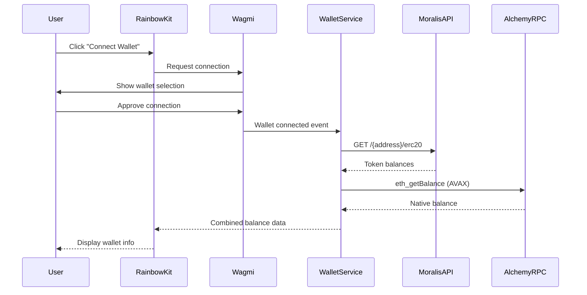
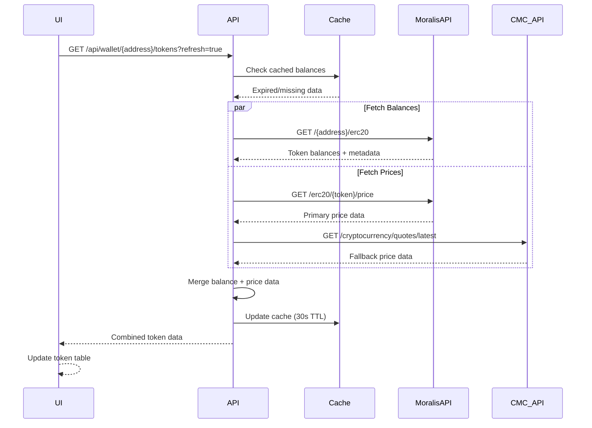
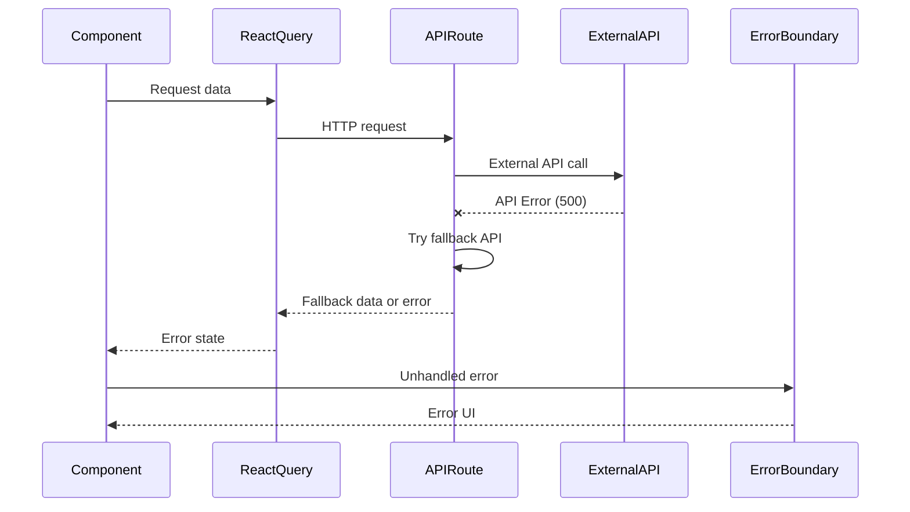

# JarryBank Fullstack Architecture Document

## Introduction

This document outlines the complete fullstack architecture for **JarryBank**, including backend systems, frontend implementation, and their integration. It serves as the single source of truth for AI-driven development, ensuring consistency across the entire technology stack.

This unified approach combines what would traditionally be separate backend and frontend architecture documents, streamlining the development process for modern fullstack applications where these concerns are increasingly intertwined.

### Starter Template Analysis

Based on your requirements for a Next.js Web3 monorepo with Vercel deployment, I recommend considering:

1. **T3 Stack** - Next.js, TypeScript, tRPC, Tailwind CSS (perfect base for Web3 apps)
2. **Turborepo starter** - Optimized monorepo with Next.js apps and shared packages
3. **Vercel Next.js templates** - Pre-configured for Vercel deployment

**Decision**: I recommend starting with a **Turborepo + Next.js** setup as it provides the monorepo structure you need while being easily deployable to Vercel.

### Change Log

| Date | Version | Description | Author |
|------|---------|-------------|--------|
| 2025-01-10 | 1.0 | Initial architecture document | Claude (Architect) |

## High Level Architecture

### Technical Summary

JarryBank is a **serverless Web3 application** built on **Next.js 14** with **App Router**, deployed on **Vercel's Edge Network**. The frontend leverages **Wagmi/Viem** for blockchain interactions with **Rainbow Kit** wallet connectivity, while the backend uses **Next.js API routes** for price aggregation from **Moralis and CoinMarketCap APIs**. The **monorepo structure** enables modular development with **shared TypeScript types** and **UI components**, supporting seamless expansion to multiple blockchains beyond the initial **Avalanche implementation**. This **Jamstack architecture** provides optimal performance through static generation and edge caching while maintaining the flexibility for real-time Web3 data.

### Platform and Infrastructure Choice

**Platform:** Vercel (Next.js optimized)  
**Key Services:** 
- Vercel Edge Functions (API routes)
- Vercel Edge Network (CDN/caching)
- Vercel Analytics & Speed Insights
- External: Moralis API, CoinMarketCap API, Alchemy/Infura RPCs

**Deployment Host and Regions:** Global Edge Network (automatic)

### Repository Structure

**Structure:** Monorepo with Turborepo  
**Monorepo Tool:** Turborepo (optimal for Vercel deployment)  
**Package Organization:** Apps (web, api) + Packages (shared, ui, web3)

### High Level Architecture Diagram

```mermaid
graph TB
    User[👤 User] --> Web[🌐 Web App<br/>Next.js + Web3]
    Web --> Wallet[🦄 Rainbow Wallet<br/>Wagmi + Viem]
    Web --> API[⚡ API Routes<br/>Next.js Serverless]
    
    API --> Moralis[📊 Moralis API<br/>Token Data]
    API --> CMC[💰 CoinMarketCap API<br/>Price Data]
    
    Wallet --> Avalanche[🏔️ Avalanche Network]
    Avalanche --> Alchemy[🔗 Alchemy RPC]
    Avalanche --> Infura[🔗 Infura RPC]
    
    Web --> CDN[🚀 Vercel Edge CDN]
    API --> Edge[⚡ Vercel Edge Functions]
    
    GHA[🤖 GitHub Actions] --> Vercel[☁️ Vercel Deployment]
```



### Architectural Patterns

- **Jamstack Architecture:** Static generation with serverless APIs - _Rationale:_ Optimal performance and global distribution for Web3 applications requiring real-time data
- **Component-Based UI:** Reusable React components with shadcn/ui and TypeScript - _Rationale:_ Consistent design system with your custom color palette and maintainable codebase
- **Wallet-First Design:** Web3 wallet as primary authentication - _Rationale:_ Native Web3 UX without traditional auth complexity
- **API Gateway Pattern:** Next.js API routes as unified data layer - _Rationale:_ Single integration point for multiple price APIs with built-in caching
- **Modular Blockchain Abstraction:** Pluggable blockchain providers - _Rationale:_ Easy expansion beyond Avalanche while maintaining consistent interfaces

## Tech Stack

| Category | Technology | Version | Purpose | Rationale |
|----------|------------|---------|---------|-----------|
| **Frontend Language** | TypeScript | ^5.6.0 | Type-safe JavaScript development | Strong typing for Web3 development, better developer experience |
| **Frontend Framework** | Next.js | ^15.1.0 | React meta-framework with App Router | Optimal for Vercel deployment, built-in API routes, server components |
| **UI Component Library** | shadcn/ui | latest | Copy-paste component system | Modern design system, perfect integration with your color palette |
| **CSS Framework** | Tailwind CSS | ^4.0.0 | Utility-first CSS framework | Latest v4 with better performance, native CSS support |
| **State Management** | Zustand | ^5.0.2 | Lightweight state management | Simple global state for wallet/token data |
| **Backend Language** | TypeScript | ^5.6.0 | Server-side type safety | Shared types between frontend/backend |
| **Backend Framework** | Next.js API Routes | ^15.1.0 | Serverless backend functions | Integrated with frontend, optimal Vercel deployment |
| **API Style** | REST API | Next.js | Simple HTTP endpoints | Perfect for price aggregation APIs |
| **Database** | None (Initial) | N/A | External APIs only | Start simple, add persistence later |
| **Cache** | Vercel Edge Cache | Built-in | Response caching | Automatic caching for price data |
| **File Storage** | None (Initial) | N/A | No file storage needed | Pure data application |
| **Web3 Library** | Wagmi | ^2.12.0 | React hooks for Ethereum | Industry standard for Web3 React apps |
| **Web3 Core** | Viem | ^2.21.0 | TypeScript Ethereum library | Modern replacement for ethers, required by Wagmi |
| **Wallet Connection** | RainbowKit | ^2.2.0 | Wallet connection UI | Beautiful wallet UX, integrates with Wagmi |
| **Blockchain** | Avalanche C-Chain | Mainnet | Primary blockchain network | As specified in requirements |
| **RPC Providers** | Alchemy & Infura | Latest APIs | Blockchain connectivity | Redundancy and reliability |
| **Price APIs** | Moralis & CoinMarketCap | Latest APIs | Token price data | Dual sources for reliability |
| **Authentication** | Wallet-based | Wagmi/RainbowKit | Web3 wallet authentication | Native Web3 auth, no traditional auth needed |
| **Frontend Testing** | Vitest | ^2.1.0 | Fast testing framework | Native Next.js support, faster than Jest |
| **Backend Testing** | Vitest | ^2.1.0 | API endpoint testing | Consistent testing across stack |
| **E2E Testing** | Playwright | ^1.48.0 | End-to-end browser testing | Best for Web3 wallet interactions |
| **Build Tool** | Turbo | ^2.3.0 | Monorepo build system | Optimal caching and parallel builds |
| **Package Manager** | pnpm | ^9.0.0 | Fast package management | Efficient for monorepos |
| **Monorepo Tool** | Turborepo | ^2.3.0 | Monorepo orchestration | Perfect Vercel integration |
| **CI/CD** | GitHub Actions | Latest | Automated deployments | As specified, controls all deployments |
| **Deployment** | Vercel | Latest | Edge deployment platform | As specified, optimal for Next.js |
| **Monitoring** | Vercel Analytics | Built-in | Performance monitoring | Integrated monitoring solution |
| **Logging** | Vercel Functions Logs | Built-in | Serverless function logging | Built-in logging for API routes |

## Data Models

### **Wallet**
**Purpose:** Represents a connected Web3 wallet and its metadata

**Key Attributes:**
- `address`: string - Ethereum wallet address (42-character hex string)
- `chainId`: number - Connected blockchain network ID (43114 for Avalanche)
- `isConnected`: boolean - Connection status
- `connector`: string - Wallet type (MetaMask, WalletConnect, etc.)
- `ensName`: string | null - ENS domain name if available

#### TypeScript Interface
```typescript
interface Wallet {
  address: `0x${string}`;
  chainId: number;
  isConnected: boolean;
  connector?: string;
  ensName?: string | null;
}
```

#### Relationships
- One-to-many with Token holdings
- Primary identifier for all user-specific data

### **Token**
**Purpose:** Represents a cryptocurrency token with metadata and price information

**Key Attributes:**
- `address`: string - Token contract address
- `symbol`: string - Token ticker symbol (e.g., AVAX, USDC)
- `name`: string - Full token name
- `decimals`: number - Token decimal places
- `logoURI`: string | null - Token logo image URL
- `chainId`: number - Blockchain network ID
- `isNative`: boolean - Whether it's the native chain token

#### TypeScript Interface
```typescript
interface Token {
  address: `0x${string}`;
  symbol: string;
  name: string;
  decimals: number;
  logoURI?: string | null;
  chainId: number;
  isNative: boolean;
}
```

#### Relationships
- One-to-many with TokenBalance
- One-to-many with TokenPrice

### **TokenBalance**
**Purpose:** Represents the quantity of tokens held in a specific wallet

**Key Attributes:**
- `walletAddress`: string - Owner wallet address
- `tokenAddress`: string - Token contract address
- `balance`: string - Raw balance (as string to handle large numbers)
- `formattedBalance`: string - Human-readable balance
- `lastUpdated`: Date - When balance was last fetched

#### TypeScript Interface
```typescript
interface TokenBalance {
  walletAddress: `0x${string}`;
  tokenAddress: `0x${string}`;
  balance: string;
  formattedBalance: string;
  lastUpdated: Date;
}
```

#### Relationships
- Belongs to one Wallet
- Belongs to one Token
- One-to-one with current TokenPrice for value calculation

### **TokenPrice**
**Purpose:** Real-time and cached price data from external APIs

**Key Attributes:**
- `tokenAddress`: string - Token contract address
- `priceUSD`: number - Current price in USD
- `change24h`: number - 24-hour price change percentage
- `marketCap`: number | null - Market capitalization
- `volume24h`: number | null - 24-hour trading volume
- `source`: 'moralis' | 'coinmarketcap' - Data source
- `lastUpdated`: Date - Price fetch timestamp
- `chainId`: number - Blockchain network

#### TypeScript Interface
```typescript
interface TokenPrice {
  tokenAddress: `0x${string}`;
  priceUSD: number;
  change24h: number;
  marketCap?: number | null;
  volume24h?: number | null;
  source: 'moralis' | 'coinmarketcap';
  lastUpdated: Date;
  chainId: number;
}
```

#### Relationships
- Belongs to one Token
- Used to calculate TokenBalance USD values

### **PortfolioSummary** (Computed)
**Purpose:** Aggregated wallet portfolio data for display

**Key Attributes:**
- `walletAddress`: string - Wallet identifier
- `totalValueUSD`: number - Total portfolio value
- `tokenCount`: number - Number of different tokens
- `lastUpdated`: Date - Last calculation time
- `change24hPercent`: number - Portfolio 24h change
- `change24hUSD`: number - Portfolio 24h change in USD

#### TypeScript Interface
```typescript
interface PortfolioSummary {
  walletAddress: `0x${string}`;
  totalValueUSD: number;
  tokenCount: number;
  lastUpdated: Date;
  change24hPercent: number;
  change24hUSD: number;
}
```

#### Relationships
- Computed from TokenBalance and TokenPrice data
- One per connected wallet

## API Specification

### **Base URL**
```
Production: https://jarrybank.vercel.app/api
Development: http://localhost:3000/api
```

### **Authentication**
All API endpoints use **wallet-based authentication** via request headers:
- `x-wallet-address`: Connected wallet address
- `x-wallet-signature`: Signed message for verification

### **Core API Routes**

#### **GET /api/wallet/[address]/tokens**
Fetch all token balances for a connected wallet

**Parameters:**
- `address` (path): Wallet address (`0x${string}`)

**Query Parameters:**
- `refresh?` (boolean): Force refresh from blockchain

**Response:**
```typescript
{
  "success": true,
  "data": {
    "walletAddress": "0x742d35...",
    "tokens": [
      {
        "address": "0x0000000000000000000000000000000000000000",
        "symbol": "AVAX",
        "name": "Avalanche",
        "decimals": 18,
        "balance": "2.5",
        "formattedBalance": "2.50",
        "logoURI": "https://...",
        "isNative": true,
        "priceUSD": 42.15,
        "valueUSD": 105.38,
        "change24h": -2.3
      }
    ],
    "totalValueUSD": 1250.75,
    "lastUpdated": "2025-01-10T10:30:00.000Z"
  }
}
```

#### **GET /api/prices/batch**
Fetch current prices for multiple tokens

**Query Parameters:**
- `tokens` (string): Comma-separated token addresses
- `chainId?` (number): Blockchain network ID (default: 43114)

**Response:**
```typescript
{
  "success": true,
  "data": {
    "prices": {
      "0x0000000000000000000000000000000000000000": {
        "priceUSD": 42.15,
        "change24h": -2.3,
        "marketCap": 15800000000,
        "volume24h": 890000000,
        "source": "moralis",
        "lastUpdated": "2025-01-10T10:30:00.000Z"
      }
    },
    "lastUpdated": "2025-01-10T10:30:00.000Z"
  }
}
```

### **Error Handling**

All endpoints return consistent error responses:

```typescript
{
  "success": false,
  "error": {
    "code": "WALLET_NOT_FOUND",
    "message": "Wallet address not found or not connected",
    "details": {
      "address": "0x742d35...",
      "chainId": 43114
    },
    "timestamp": "2025-01-10T10:30:00.000Z",
    "requestId": "req_abc123"
  }
}
```

**Error Codes:**
- `WALLET_NOT_FOUND`: Wallet not connected or invalid
- `INVALID_TOKEN_ADDRESS`: Token address format invalid
- `PRICE_DATA_UNAVAILABLE`: Price APIs unavailable
- `RATE_LIMIT_EXCEEDED`: API rate limit hit
- `BLOCKCHAIN_ERROR`: RPC provider error
- `VALIDATION_ERROR`: Request validation failed

## Components

### **Web Application Layer (`apps/web/`)**

#### **WalletConnection Component**
**Responsibility:** Handle wallet connection, disconnection, and account switching using RainbowKit

**Key Interfaces:**
- `useAccount()` - Get current wallet state
- `useConnect()` - Connect wallet functionality
- `useDisconnect()` - Disconnect wallet functionality

**Dependencies:** RainbowKit, Wagmi, Viem

**Technology Stack:** React + TypeScript + RainbowKit + Wagmi hooks

#### **TokenTable Component** 
**Responsibility:** Display wallet's token balances in a sortable, filterable table

**Key Interfaces:**
- `TokenTableProps` - Receives token data and loading states
- `onRefresh()` - Trigger balance refresh
- `onSort()` - Handle column sorting

**Dependencies:** Token Balance API, Price API, shadcn/ui Table components

**Technology Stack:** React + TypeScript + shadcn/ui + TanStack Table

#### **PortfolioSummary Component**
**Responsibility:** Show aggregated portfolio value, change indicators, and key metrics

**Key Interfaces:**
- `PortfolioSummaryProps` - Portfolio data and update timestamps
- `formatCurrency()` - Currency formatting utilities
- `formatPercentage()` - Percentage change formatting

**Dependencies:** Portfolio API, Token Price API

**Technology Stack:** React + TypeScript + shadcn/ui Cards + Custom hooks

#### **PriceProvider Component**
**Responsibility:** Real-time price updates and caching using React Query

**Key Interfaces:**
- `usePrices()` - Hook for accessing cached price data
- `useTokenPrice()` - Hook for individual token prices
- `invalidatePrice()` - Force price refresh

**Dependencies:** TanStack Query, API Layer

**Technology Stack:** React Query + Custom hooks + TypeScript

### **API Layer (`apps/api/` or Next.js API Routes)**

#### **WalletService**
**Responsibility:** Manage wallet operations and blockchain interactions

**Key Interfaces:**
- `getTokenBalances(address, chainId)` - Fetch wallet token balances
- `getWalletInfo(address)` - Get wallet metadata and connection status
- `validateWalletAddress(address)` - Address validation

**Dependencies:** Viem clients, RPC providers (Alchemy/Infura)

**Technology Stack:** Next.js API Routes + Viem + TypeScript

#### **PriceService**  
**Responsibility:** Aggregate price data from multiple sources with fallback logic

**Key Interfaces:**
- `getBatchPrices(tokenAddresses)` - Fetch multiple token prices
- `getTokenPrice(tokenAddress, chainId)` - Get single token price
- `getPriceHistory(tokenAddress, timeframe)` - Historical price data

**Dependencies:** Moralis API, CoinMarketCap API, Redis cache (future)

**Technology Stack:** Next.js API Routes + External API clients + TypeScript

#### **CacheService**
**Responsibility:** Implement caching layer for API responses and external data

**Key Interfaces:**
- `get(key)` - Retrieve cached data
- `set(key, value, ttl)` - Cache data with TTL
- `invalidate(pattern)` - Clear cache by pattern

**Dependencies:** Vercel Edge Cache, Memory cache fallback

**Technology Stack:** Vercel Edge Runtime + Custom caching logic

## External APIs

### **Moralis Web3 API**
- **Purpose:** Primary source for token metadata, balances, and price data
- **Documentation:** https://docs.moralis.com/web3-data-api/evm
- **Base URL(s):** https://deep-index.moralis.io/api/v2.2
- **Authentication:** API Key in `X-API-Key` header
- **Rate Limits:** 25 requests/second (paid tiers available)

**Key Endpoints Used:**
- `GET /{address}/erc20` - Get ERC-20 token balances for wallet
- `GET /erc20/{address}/price` - Get current token price
- `GET /erc20/metadata` - Get token metadata (name, symbol, decimals, logo)

**Integration Notes:** Primary API due to comprehensive Avalanche support and real-time price updates. Includes built-in caching and batch request capabilities.

### **CoinMarketCap API**
- **Purpose:** Secondary price data source with market metrics and fallback pricing
- **Documentation:** https://coinmarketcap.com/api/documentation/v1/
- **Base URL(s):** https://pro-api.coinmarketcap.com/v2
- **Authentication:** API Key in `X-CMC_PRO_API_KEY` header  
- **Rate Limits:** 333 calls/day (Basic plan), 10,000 calls/month (paid plans)

**Key Endpoints Used:**
- `GET /cryptocurrency/quotes/latest` - Current price quotes for tokens
- `GET /cryptocurrency/info` - Token metadata and descriptions
- `GET /tools/price-conversion` - Convert between token prices

**Integration Notes:** Used as backup when Moralis is unavailable or for tokens not covered by Moralis. Provides market cap and volume data not available from other sources.

### **Alchemy RPC Provider**  
- **Purpose:** Primary Avalanche blockchain RPC access
- **Documentation:** https://docs.alchemy.com/reference/avalanche-api-quickstart
- **Base URL(s):** https://avax-mainnet.g.alchemy.com/v2/{API_KEY}
- **Authentication:** API Key in URL path
- **Rate Limits:** 300 requests/second (Growth plan)

**Key Endpoints Used:**
- `eth_getBalance` - Get native AVAX balance
- `eth_call` - Call contract methods (token balances)
- `eth_blockNumber` - Get current block number

**Integration Notes:** Primary RPC for direct blockchain queries. Provides higher reliability than public RPCs and includes enhanced APIs for token data.

### **Infura RPC Provider**
- **Purpose:** Backup Avalanche blockchain RPC access  
- **Documentation:** https://docs.infura.io/api/networks/avalanche-c-chain
- **Base URL(s):** https://avalanche-mainnet.infura.io/v3/{PROJECT_ID}
- **Authentication:** Project ID in URL path
- **Rate Limits:** 100,000 requests/day (Core plan)

**Key Endpoints Used:**
- `eth_getBalance` - Get native AVAX balance (backup)
- `eth_call` - Contract calls (backup)
- `net_version` - Network verification

**Integration Notes:** Fallback RPC provider when Alchemy is unavailable. Ensures high availability for blockchain data access.

## Core Workflows

### **Wallet Connection & Initial Load**



### **Token Balance Refresh Flow**



## Database Schema

**Initial Implementation: No Traditional Database Required**

JarryBank starts with a **stateless architecture** leveraging external APIs and blockchain data sources. No persistent database is required for the initial version:

**Data Sources:**
- **Blockchain State**: Token balances via Avalanche RPC (Alchemy/Infura)  
- **Token Metadata**: Moralis API provides names, symbols, logos
- **Price Data**: Moralis + CoinMarketCap APIs for real-time pricing
- **User Sessions**: Wallet-based auth, no user accounts to store

**Caching Layer (Vercel Edge Cache):**
```typescript
// Cache structure (in-memory/Redis future)
interface CacheData {
  key: string;           // "wallet:0x123:tokens" 
  data: any;            // Cached response data
  expiry: number;       // Unix timestamp
  source: string;       // "moralis" | "cmc" | "alchemy"
}
```

**Future Database Migration Path:**
When persistence becomes necessary, the architecture supports adding:
- **PostgreSQL**: User preferences, custom token lists
- **Redis**: Enhanced caching and session management  
- **Analytics Database**: Usage metrics and performance data

## Frontend Architecture

### **Component Architecture**

**Component Organization:**
```
apps/web/src/
├── components/           # UI components
│   ├── ui/              # shadcn/ui base components  
│   ├── wallet/          # Wallet-specific components
│   ├── tokens/          # Token display components
│   └── layout/          # Layout and navigation
├── hooks/               # Custom React hooks
├── lib/                 # Utilities and configurations
├── stores/              # Zustand state management
└── styles/              # Global styles and themes
```

**Component Template (TokenTable):**
```typescript
import { useTokens } from '@/hooks/useTokens';
import { Table, TableBody, TableCell, TableHead, TableHeader, TableRow } from '@/components/ui/table';

interface TokenTableProps {
  walletAddress: `0x${string}`;
  refreshTrigger?: number;
}

export function TokenTable({ walletAddress, refreshTrigger }: TokenTableProps) {
  const { tokens, isLoading, error, refetch } = useTokens(walletAddress, refreshTrigger);
  
  if (isLoading) return <TokenTableSkeleton />;
  if (error) return <ErrorDisplay error={error} onRetry={refetch} />;
  
  return (
    <Table>
      <TableHeader>
        <TableRow>
          <TableHead>Token</TableHead>
          <TableHead>Balance</TableHead>
          <TableHead>Price</TableHead>
          <TableHead>Value</TableHead>
          <TableHead>24h Change</TableHead>
        </TableRow>
      </TableHeader>
      <TableBody>
        {tokens.map((token) => (
          <TokenRow key={token.address} token={token} />
        ))}
      </TableBody>
    </Table>
  );
}
```

### **State Management Architecture**

**State Structure (Zustand):**
```typescript
interface WalletState {
  // Wallet connection state
  address: `0x${string}` | null;
  isConnected: boolean;
  chainId: number;
  connector?: string;
  
  // Actions
  setWallet: (wallet: WalletInfo) => void;
  disconnect: () => void;
}

interface TokenState {
  // Token data cache
  tokensByWallet: Record<string, TokenBalance[]>;
  prices: Record<string, TokenPrice>;
  lastUpdated: Record<string, number>;
  
  // Actions  
  setTokens: (walletAddress: string, tokens: TokenBalance[]) => void;
  updatePrices: (prices: Record<string, TokenPrice>) => void;
  clearWalletTokens: (walletAddress: string) => void;
}
```

### **Routing Architecture**  

**Route Organization (Next.js App Router):**
```
apps/web/src/app/
├── page.tsx                 # Home page with wallet connection
├── dashboard/               # Main app dashboard
│   ├── page.tsx            # Token table and portfolio summary
│   └── loading.tsx         # Loading UI for dashboard
├── api/                    # API routes
│   ├── wallet/[address]/   
│   │   ├── tokens/route.ts # Token balance API
│   │   └── portfolio/route.ts # Portfolio summary API
│   └── prices/
│       ├── batch/route.ts  # Batch price fetching
│       └── [token]/route.ts # Individual token price
├── layout.tsx              # Root layout with providers
└── globals.css            # Global styles with custom variables
```

### **Frontend Services Layer**

**API Client Setup:**
```typescript
// lib/api-client.ts
class APIClient {
  private baseURL = process.env.NEXT_PUBLIC_API_URL || '/api';
  
  async request<T>(endpoint: string, options?: RequestInit): Promise<T> {
    const response = await fetch(`${this.baseURL}${endpoint}`, {
      headers: {
        'Content-Type': 'application/json',
        'x-wallet-address': this.walletAddress || '',
        ...options?.headers,
      },
      ...options,
    });
    
    if (!response.ok) {
      throw new APIError(response.status, await response.text());
    }
    
    return response.json();
  }
  
  // Wallet-specific methods
  getTokens(address: string, refresh?: boolean) {
    const params = refresh ? '?refresh=true' : '';
    return this.request<TokenResponse>(`/wallet/${address}/tokens${params}`);
  }
  
  getBatchPrices(tokenAddresses: string[], chainId?: number) {
    const params = new URLSearchParams({
      tokens: tokenAddresses.join(','),
      ...(chainId && { chainId: chainId.toString() }),
    });
    return this.request<PriceResponse>(`/prices/batch?${params}`);
  }
}
```

## Backend Architecture

### **Serverless Architecture (Next.js API Routes on Vercel)**

**Function Template (Token Balance Service):**
```typescript
// app/api/wallet/[address]/tokens/route.ts
import { NextRequest } from 'next/server';
import { WalletService } from '@/lib/services/wallet';
import { PriceService } from '@/lib/services/price';
import { validateWalletAddress } from '@/lib/utils/validation';

export async function GET(
  request: NextRequest,
  { params }: { params: { address: string } }
) {
  try {
    const { address } = params;
    const refresh = request.nextUrl.searchParams.get('refresh') === 'true';
    
    // Validate wallet address format
    if (!validateWalletAddress(address)) {
      return Response.json({
        success: false,
        error: { code: 'INVALID_ADDRESS', message: 'Invalid wallet address format' }
      }, { status: 400 });
    }

    // Get token balances (with caching unless refresh=true)
    const walletService = new WalletService();
    const priceService = new PriceService();
    
    const tokens = await walletService.getTokenBalances(address as `0x${string}`, refresh);
    const prices = await priceService.getBatchPrices(
      tokens.map(t => t.tokenAddress),
      43114 // Avalanche
    );
    
    // Merge balance and price data
    const enrichedTokens = tokens.map(token => ({
      ...token,
      priceUSD: prices[token.tokenAddress]?.priceUSD || 0,
      valueUSD: parseFloat(token.formattedBalance) * (prices[token.tokenAddress]?.priceUSD || 0),
      change24h: prices[token.tokenAddress]?.change24h || 0
    }));

    const response = {
      success: true,
      data: {
        walletAddress: address,
        tokens: enrichedTokens,
        totalValueUSD: enrichedTokens.reduce((sum, token) => sum + token.valueUSD, 0),
        lastUpdated: new Date().toISOString()
      }
    };

    return Response.json(response, {
      headers: {
        'Cache-Control': refresh ? 'no-cache' : 's-maxage=30, stale-while-revalidate=60'
      }
    });
  } catch (error) {
    return Response.json({
      success: false,
      error: {
        code: 'INTERNAL_ERROR',
        message: error instanceof Error ? error.message : 'Unknown error',
        timestamp: new Date().toISOString()
      }
    }, { status: 500 });
  }
}
```

## Unified Project Structure

```
jarrybank/
├── .github/                          # CI/CD workflows
│   └── workflows/
│       ├── ci.yaml                   # Test and lint on PR/push
│       ├── deploy-web.yaml           # Deploy web app to Vercel
│       └── deploy-api.yaml           # Deploy API functions (if separate)
├── apps/                             # Application packages
│   ├── web/                          # Frontend Next.js application
│   │   ├── src/
│   │   │   ├── app/                  # Next.js App Router
│   │   │   │   ├── (auth)/           # Route groups
│   │   │   │   │   └── dashboard/    # Protected dashboard routes
│   │   │   │   ├── api/              # API routes (serverless functions)
│   │   │   │   │   ├── wallet/[address]/
│   │   │   │   │   │   ├── tokens/route.ts
│   │   │   │   │   │   └── portfolio/route.ts
│   │   │   │   │   ├── prices/
│   │   │   │   │   │   ├── batch/route.ts
│   │   │   │   │   │   └── [token]/route.ts
│   │   │   │   │   └── health/route.ts
│   │   │   │   ├── globals.css       # Global styles with custom variables
│   │   │   │   ├── layout.tsx        # Root layout with providers
│   │   │   │   ├── page.tsx          # Landing page
│   │   │   │   └── loading.tsx       # Global loading UI
│   │   │   ├── components/           # UI components
│   │   │   │   ├── ui/               # shadcn/ui components
│   │   │   │   ├── wallet/           # Wallet connection components
│   │   │   │   ├── tokens/           # Token display components
│   │   │   │   └── layout/           # Layout components
│   │   │   ├── hooks/                # Custom React hooks
│   │   │   ├── lib/                  # Utilities and configurations
│   │   │   ├── stores/               # Zustand state management
│   │   │   └── styles/               # Additional styles
│   │   ├── public/                   # Static assets
│   │   ├── tests/                    # Frontend tests
│   │   ├── .env.local.example        # Environment variables template
│   │   ├── next.config.js            # Next.js configuration
│   │   ├── tailwind.config.ts        # Tailwind configuration
│   │   ├── components.json           # shadcn/ui configuration
│   │   ├── tsconfig.json             # TypeScript configuration
│   │   └── package.json              # Web app dependencies
├── packages/                         # Shared packages
│   ├── shared/                       # Shared types and utilities
│   │   ├── src/
│   │   │   ├── types/                # TypeScript interfaces
│   │   │   ├── constants/            # Shared constants
│   │   │   ├── utils/                # Shared utilities
│   │   │   └── index.ts              # Package exports
│   │   ├── tsconfig.json             # Package TypeScript config
│   │   └── package.json              # Shared package dependencies
│   ├── ui/                           # Shared UI components
│   │   ├── src/
│   │   │   ├── components/           # shadcn/ui customized components
│   │   │   ├── styles/               # Component styles
│   │   │   ├── lib/                  # UI utilities
│   │   │   └── index.ts              # Package exports
│   │   ├── tailwind.config.ts        # UI package Tailwind config
│   │   ├── tsconfig.json
│   │   └── package.json
│   ├── web3/                         # Web3-specific utilities
│   │   ├── src/
│   │   │   ├── config/               # Web3 configurations
│   │   │   ├── utils/                # Web3 utilities
│   │   │   ├── hooks/                # Web3-specific hooks
│   │   │   └── index.ts
│   │   ├── tsconfig.json
│   │   └── package.json
│   └── config/                       # Shared configuration
│       ├── eslint/                   # ESLint configurations
│       ├── typescript/               # TypeScript configurations
│       └── jest/                     # Jest test configurations
├── scripts/                          # Build and deployment scripts
├── docs/                             # Project documentation
│   ├── architecture.md               # This architecture document
│   ├── SETUP.md                      # Development setup guide
│   ├── DEPLOYMENT.md                 # Deployment instructions
│   └── API.md                        # API documentation
├── .env.example                      # Global environment template
├── .gitignore                        # Git ignore rules
├── package.json                      # Root package.json with workspace config
├── pnpm-workspace.yaml               # pnpm workspace configuration
├── turbo.json                        # Turborepo configuration
├── README.md                         # Project overview and setup
└── CLAUDE.md                         # AI development context file
```

## Development Workflow

### **Local Development Setup**

**Prerequisites:**
```bash
# Install Node.js 20+ and pnpm
curl -fsSL https://get.pnpm.io/install.sh | sh
pnpm --version # Verify installation
```

**Initial Setup:**
```bash
# Clone repository
git clone <repository-url> jarrybank
cd jarrybank

# Install all dependencies (workspace aware)
pnpm install

# Copy environment variables
cp .env.example .env.local
cp apps/web/.env.local.example apps/web/.env.local

# Generate shadcn/ui components (optional)
cd apps/web && pnpm dlx shadcn@latest init
```

**Development Commands:**
```bash
# Start all services (web app + API)
pnpm dev

# Start only frontend
pnpm dev --filter=web

# Build all packages
pnpm build

# Run tests across all packages
pnpm test

# Lint entire codebase
pnpm lint

# TypeScript type checking
pnpm type-check
```

### **Environment Configuration**

**Frontend Environment Variables (apps/web/.env.local):**
```bash
# App Configuration
NEXT_PUBLIC_APP_NAME="JarryBank"
NEXT_PUBLIC_API_URL="/api"

# Web3 Configuration
NEXT_PUBLIC_WALLETCONNECT_PROJECT_ID="your_project_id_here"
NEXT_PUBLIC_ALCHEMY_API_KEY="your_alchemy_key_here"
NEXT_PUBLIC_INFURA_API_KEY="your_infura_key_here"

# Chain Configuration (Avalanche)
NEXT_PUBLIC_DEFAULT_CHAIN_ID="43114"
NEXT_PUBLIC_SUPPORTED_CHAINS="43114"

# External APIs
MORALIS_API_KEY="your_moralis_api_key_here"
COINMARKETCAP_API_KEY="your_cmc_api_key_here"

# Development
NODE_ENV="development"
```

**Backend Environment Variables (for API routes):**
```bash
# External API Keys (server-side only)
MORALIS_API_KEY="your_moralis_api_key_here"
COINMARKETCAP_API_KEY="your_cmc_api_key_here"

# RPC Providers
ALCHEMY_API_KEY="your_alchemy_key_here"  
INFURA_API_KEY="your_infura_key_here"

# Caching (future)
REDIS_URL="redis://localhost:6379"

# Monitoring (future)
SENTRY_DSN="your_sentry_dsn_here"
```

## Deployment Architecture

### **Deployment Strategy**

**Frontend Deployment:**
- **Platform:** Vercel (automatic deployment)
- **Build Command:** `pnpm build --filter=web`
- **Output Directory:** `apps/web/.next`
- **CDN/Edge:** Vercel Edge Network (global)

**Backend Deployment:**
- **Platform:** Vercel Serverless Functions (same deployment)
- **Build Command:** Included in frontend build
- **Deployment Method:** Next.js API routes → Vercel Functions

### **CI/CD Pipeline**

**GitHub Actions Workflow (.github/workflows/ci.yaml):**
```yaml
name: CI/CD Pipeline
on:
  push:
    branches: [main, develop]
  pull_request:
    branches: [main]

jobs:
  test:
    runs-on: ubuntu-latest
    steps:
      - uses: actions/checkout@v4
      - uses: pnpm/action-setup@v2
        with:
          version: 9
      - uses: actions/setup-node@v4
        with:
          node-version: '20'
          cache: 'pnpm'
      
      - name: Install dependencies
        run: pnpm install --frozen-lockfile
      
      - name: Type check
        run: pnpm type-check
      
      - name: Lint
        run: pnpm lint
      
      - name: Test
        run: pnpm test
      
      - name: Build
        run: pnpm build

  deploy:
    needs: test
    runs-on: ubuntu-latest
    if: github.ref == 'refs/heads/main'
    steps:
      - uses: actions/checkout@v4
      
      - name: Deploy to Vercel
        uses: amondnet/vercel-action@v25
        with:
          vercel-token: ${{ secrets.VERCEL_TOKEN }}
          github-token: ${{ secrets.GITHUB_TOKEN }}
          vercel-args: '--prod'
          working-directory: apps/web
```

### **Environments**

| Environment | Frontend URL | Backend URL | Purpose |
|-------------|-------------|-------------|----------|
| Development | http://localhost:3000 | http://localhost:3000/api | Local development |
| Preview | https://jarrybank-git-feature-*.vercel.app | Same domain/api | Feature branch testing |
| Production | https://jarrybank.vercel.app | https://jarrybank.vercel.app/api | Live environment |

## Security and Performance

### **Security Requirements**

**Frontend Security:**
- **CSP Headers:** `default-src 'self'; connect-src 'self' https://*.moralis.io https://*.coinmarketcap.com https://*.alchemy.com https://*.infura.io; img-src 'self' data: https:; style-src 'self' 'unsafe-inline'`
- **XSS Prevention:** All user inputs sanitized, shadcn/ui components escape by default, strict TypeScript typing prevents injection
- **Secure Storage:** Wallet private keys never stored, session data in memory only, sensitive data encrypted in localStorage

**Backend Security:**
- **Input Validation:** Zod schemas validate all API inputs, wallet addresses verified with checksum validation
- **Rate Limiting:** 100 requests/minute per IP, 300 requests/minute per authenticated wallet, progressive backoff for abuse
- **CORS Policy:** `https://jarrybank.vercel.app` and `localhost:3000` for development, no wildcards in production

**Authentication Security:**
- **Token Storage:** No traditional tokens, wallet signatures provide authentication, signatures expire after 5 minutes
- **Session Management:** Stateless authentication, each request independently verified, no server-side session storage  
- **Password Policy:** N/A - Wallet-based authentication only, users manage their own wallet security

### **Performance Optimization**

**Frontend Performance:**
- **Bundle Size Target:** < 500KB initial bundle, < 1MB total JavaScript, code splitting by route and component
- **Loading Strategy:** Incremental Static Regeneration for static content, lazy loading for components, prefetch critical routes
- **Caching Strategy:** React Query with 30s stale time, Vercel Edge caching for API responses, aggressive browser caching for assets

**Backend Performance:**
- **Response Time Target:** < 200ms for cached data, < 2s for fresh blockchain queries, < 500ms for price data
- **Database Optimization:** Proper indexing on wallet addresses and timestamps, connection pooling, query optimization
- **Caching Strategy:** Vercel Edge cache for API responses, Redis for session data (future), CDN for static assets

## Testing Strategy

### **Testing Pyramid**
```
                E2E Tests (Playwright)
               /                    \
        Integration Tests (Vitest + MSW)
           /                            \
    Frontend Unit (Vitest + Testing Library)  Backend Unit (Vitest + Supertest)
```

### **Test Organization**

**Frontend Tests:**
```
apps/web/tests/
├── __mocks__/                    # Shared test mocks
├── components/                   # Component tests
├── hooks/                       # Custom hook tests
├── utils/                       # Utility function tests
└── setup.ts                    # Test environment setup
```

**Backend Tests:**
```
apps/web/tests/api/
├── wallet/                      # API route tests
├── prices/                     # Price API tests
├── services/                   # Service layer tests
└── mocks/                      # API mocks
```

**E2E Tests:**
```
tests/e2e/
├── wallet-connection.spec.ts    # Wallet connection flow
├── token-viewing.spec.ts        # Token balance display
├── price-updates.spec.ts        # Real-time price updates
├── error-handling.spec.ts       # Error state handling
└── performance.spec.ts          # Core Web Vitals
```

## Coding Standards

### **Critical Fullstack Rules**

- **Type Sharing:** Always define types in packages/shared and import from there - prevents type drift between frontend/backend
- **API Calls:** Never make direct HTTP calls from components - use the service layer and React Query hooks for consistency
- **Environment Variables:** Access only through config objects, never process.env directly - enables proper validation and type safety
- **Error Handling:** All API routes must use the standard error format with success/error structure - ensures consistent client handling
- **State Updates:** Never mutate Zustand state directly - use actions to maintain predictable state changes
- **Wallet Address Format:** Always use `0x${string}` type for addresses - provides compile-time validation of address format
- **External API Calls:** Always implement fallback logic for external APIs - Moralis → CoinMarketCap → cached data
- **Cache TTL:** Respect cache TTL values: 30s for balances, 60s for prices - prevents excessive API calls

### **Naming Conventions**

| Element | Frontend | Backend | Example |
|---------|----------|---------|---------|
| **Components** | PascalCase | - | `TokenTable.tsx`, `WalletConnectButton.tsx` |
| **Hooks** | camelCase with 'use' | - | `useTokens.ts`, `useWalletConnection.ts` |
| **API Routes** | - | kebab-case | `/api/wallet-tokens`, `/api/price-batch` |
| **Database Tables** | - | snake_case | `wallet_balances`, `price_cache` |
| **Types/Interfaces** | PascalCase | PascalCase | `TokenBalance`, `WalletInfo` |
| **Constants** | SCREAMING_SNAKE_CASE | SCREAMING_SNAKE_CASE | `AVALANCHE_CHAIN_ID`, `API_BASE_URL` |

## Error Handling Strategy

### **Error Flow**


### **Error Response Format**
```typescript
interface ApiError {
  error: {
    code: string;           // Machine-readable error code
    message: string;        // Human-readable error message
    details?: Record<string, any>; // Additional error context
    timestamp: string;      // ISO timestamp when error occurred
    requestId: string;      // Unique request identifier for tracing
  };
}
```

## Monitoring and Observability

### **Monitoring Stack**
- **Frontend Monitoring:** Vercel Analytics for Core Web Vitals, user interactions, and performance metrics
- **Backend Monitoring:** Vercel Function Logs for API performance, error rates, and execution metrics  
- **Error Tracking:** Built-in error boundaries with console logging, future Sentry integration planned
- **Performance Monitoring:** Vercel Speed Insights for real user monitoring and synthetic testing

### **Key Metrics**

**Frontend Metrics:**
- Core Web Vitals (LCP < 2.5s, FID < 100ms, CLS < 0.1)
- JavaScript errors and unhandled promise rejections
- API response times from client perspective
- User interactions (wallet connections, token refreshes, navigation)

**Backend Metrics:**
- Request rate per API endpoint
- Error rate by endpoint and error type
- Response time percentiles (p50, p95, p99)
- Database query performance (when implemented)
- External API dependency health and latency

---

## Summary

This architecture document provides a comprehensive blueprint for building JarryBank as a modern, scalable Web3 application. The design prioritizes:

- **Rapid Development**: Simple initial implementation with room for complexity
- **Modern Stack**: Latest versions of Next.js, Wagmi, and supporting technologies
- **Modularity**: Monorepo structure enabling easy expansion to new blockchains
- **Performance**: Edge deployment and aggressive caching strategies
- **Reliability**: Multiple API sources and comprehensive error handling
- **User Experience**: Your custom design system and smooth Web3 interactions

The architecture is production-ready while maintaining the flexibility to evolve as JarryBank grows and adds new features.

🚀 **Generated with [Claude Code](https://claude.ai/code)**

Co-Authored-By: Claude <noreply@anthropic.com>