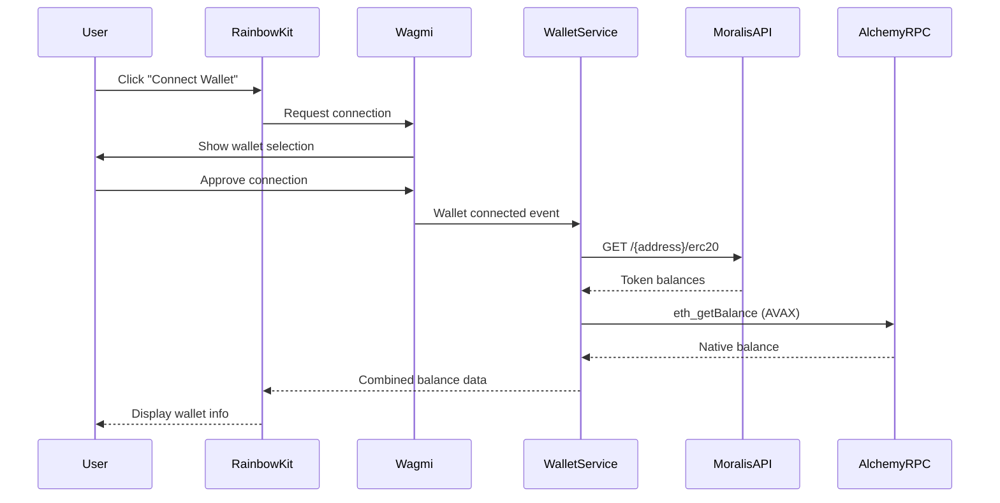
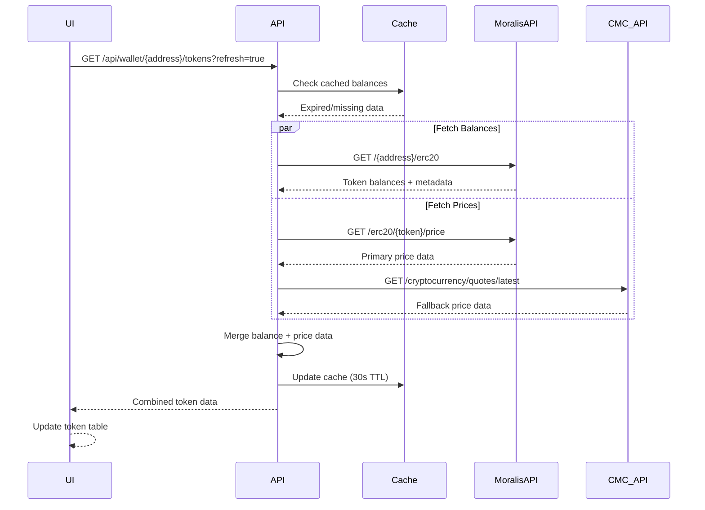

# Core Workflows

## **Wallet Connection & Initial Load**

```mermaid
sequenceDiagram
    participant User
    participant RainbowKit
    participant Wagmi
    participant WalletService
    participant MoralisAPI
    participant AlchemyRPC

    User->>RainbowKit: Click "Connect Wallet"
    RainbowKit->>Wagmi: Request connection
    Wagmi->>User: Show wallet selection
    User->>Wagmi: Approve connection
    Wagmi->>WalletService: Wallet connected event
    WalletService->>MoralisAPI: GET /{address}/erc20
    MoralisAPI-->>WalletService: Token balances
    WalletService->>AlchemyRPC: eth_getBalance (AVAX)
    AlchemyRPC-->>WalletService: Native balance
    WalletService-->>RainbowKit: Combined balance data
    RainbowKit-->>User: Display wallet info
```

## **Token Balance Refresh Flow**

```mermaid
sequenceDiagram
    participant UI
    participant API
    participant Cache
    participant MoralisAPI
    participant CMC_API
    
    UI->>API: GET /api/wallet/{address}/tokens?refresh=true
    API->>Cache: Check cached balances
    Cache-->>API: Expired/missing data
    
    par Fetch Balances
        API->>MoralisAPI: GET /{address}/erc20
        MoralisAPI-->>API: Token balances + metadata
    and Fetch Prices
        API->>MoralisAPI: GET /erc20/{token}/price
        MoralisAPI-->>API: Primary price data
        API->>CMC_API: GET /cryptocurrency/quotes/latest  
        CMC_API-->>API: Fallback price data
    end
    
    API->>API: Merge balance + price data
    API->>Cache: Update cache (30s TTL)
    API-->>UI: Combined token data
    UI-->>UI: Update token table
```
