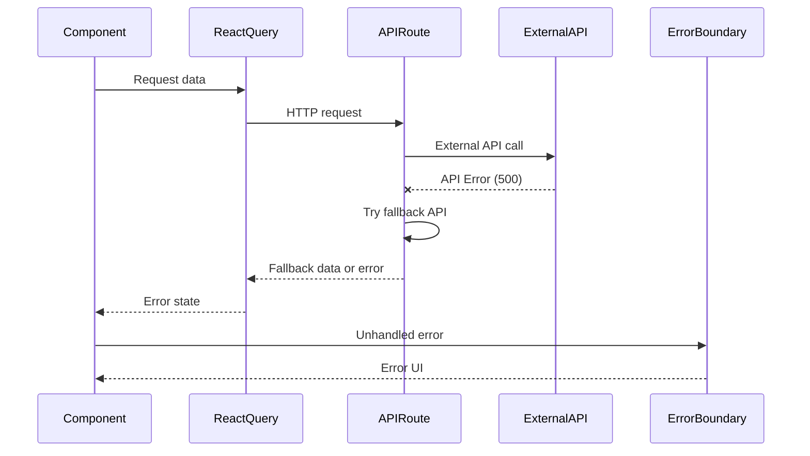

# Error Handling Strategy

## **Error Flow**


## **Error Response Format**
```typescript
interface ApiError {
  error: {
    code: string;           // Machine-readable error code
    message: string;        // Human-readable error message
    details?: Record<string, any>; // Additional error context
    timestamp: string;      // ISO timestamp when error occurred
    requestId: string;      // Unique request identifier for tracing
  };
}
```
