# High Level Architecture

## Technical Summary

JarryBank is a **serverless Web3 application** built on **Next.js 14** with **App Router**, deployed on **Vercel's Edge Network**. The frontend leverages **Wagmi/Viem** for blockchain interactions with **Rainbow Kit** wallet connectivity, while the backend uses **Next.js API routes** for price aggregation from **Moralis and CoinMarketCap APIs**. The **monorepo structure** enables modular development with **shared TypeScript types** and **UI components**, supporting seamless expansion to multiple blockchains beyond the initial **Avalanche implementation**. This **Jamstack architecture** provides optimal performance through static generation and edge caching while maintaining the flexibility for real-time Web3 data.

## Platform and Infrastructure Choice

**Platform:** Vercel (Next.js optimized)  
**Key Services:** 
- Vercel Edge Functions (API routes)
- Vercel Edge Network (CDN/caching)
- Vercel Analytics & Speed Insights
- External: Moralis API, CoinMarketCap API, Alchemy/Infura RPCs

**Deployment Host and Regions:** Global Edge Network (automatic)

## Repository Structure

**Structure:** Monorepo with Turborepo  
**Monorepo Tool:** Turborepo (optimal for Vercel deployment)  
**Package Organization:** Apps (web, api) + Packages (shared, ui, web3)

## High Level Architecture Diagram

```mermaid
graph TB
    User[👤 User] --> Web[🌐 Web App<br/>Next.js + Web3]
    Web --> Wallet[🦄 Rainbow Wallet<br/>Wagmi + Viem]
    Web --> API[⚡ API Routes<br/>Next.js Serverless]
    
    API --> Moralis[📊 Moralis API<br/>Token Data]
    API --> CMC[💰 CoinMarketCap API<br/>Price Data]
    
    Wallet --> Avalanche[🏔️ Avalanche Network]
    Avalanche --> Alchemy[🔗 Alchemy RPC]
    Avalanche --> Infura[🔗 Infura RPC]
    
    Web --> CDN[🚀 Vercel Edge CDN]
    API --> Edge[⚡ Vercel Edge Functions]
    
    GHA[🤖 GitHub Actions] --> Vercel[☁️ Vercel Deployment]
```

## Architectural Patterns

- **Jamstack Architecture:** Static generation with serverless APIs - _Rationale:_ Optimal performance and global distribution for Web3 applications requiring real-time data
- **Component-Based UI:** Reusable React components with shadcn/ui and TypeScript - _Rationale:_ Consistent design system with your custom color palette and maintainable codebase
- **Wallet-First Design:** Web3 wallet as primary authentication - _Rationale:_ Native Web3 UX without traditional auth complexity
- **API Gateway Pattern:** Next.js API routes as unified data layer - _Rationale:_ Single integration point for multiple price APIs with built-in caching
- **Modular Blockchain Abstraction:** Pluggable blockchain providers - _Rationale:_ Easy expansion beyond Avalanche while maintaining consistent interfaces
