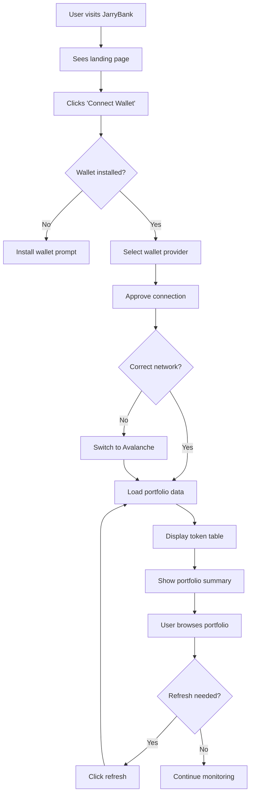
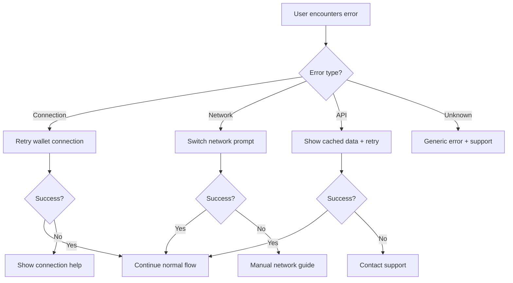

# User Journey & Flows

## Primary User Flow: Portfolio Discovery

```mermaid
flowchart TD
    A[User visits JarryBank] --> B[Sees landing page]
    B --> C[Clicks 'Connect Wallet']
    C --> D{Wallet installed?}
    D -->|No| E[Install wallet prompt]
    D -->|Yes| F[Select wallet provider]
    F --> G[Approve connection]
    G --> H{Correct network?}
    H -->|No| I[Switch to Avalanche]
    H -->|Yes| J[Load portfolio data]
    I --> J
    J --> K[Display token table]
    K --> L[Show portfolio summary]
    L --> M[User browses portfolio]
    M --> N{Refresh needed?}
    N -->|Yes| O[Click refresh]
    N -->|No| P[Continue monitoring]
    O --> J
```

## Error Recovery Flow

```mermaid
flowchart TD
    A[User encounters error] --> B{Error type?}
    B -->|Connection| C[Retry wallet connection]
    B -->|Network| D[Switch network prompt]
    B -->|API| E[Show cached data + retry]
    B -->|Unknown| F[Generic error + support]
    
    C --> G{Success?}
    D --> H{Success?}
    E --> I{Success?}
    
    G -->|Yes| J[Continue normal flow]
    G -->|No| K[Show connection help]
    H -->|Yes| J
    H -->|No| L[Manual network guide]
    I -->|Yes| J
    I -->|No| M[Contact support]
```

---
